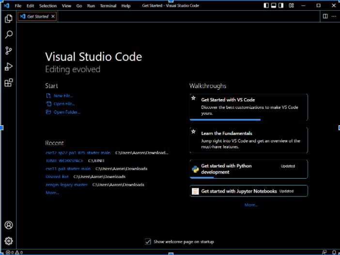

Personally, I had already installed and used VSCode before.

But VSCode can be easily downloaded by going to

[their website](https://code.visualstudio.com/) and following the instructions in order to use it.  

First, I [installed SSH](https://docs.microsoft.com/en-us/windows-server/administration/openssh/openssh_install_firstuse)

Then, I logged in using the specific account created for me
for this class, and my UCSD password, which I had to reset.  

There was a warning message that appears every time you login to 
somewhere new.  

This specific command would have copy and pasted(cp) the code hello.txt which was made by someone else

Access was denied because students only have access to their code, not other people's code, on the server.  

The first picture shows me running the WhereAmI code(which gives 
the properties of the computer which it is ran on).

I then copied the code and sent it to my account on the server in 
the CSE basement.

In the second picture, I access and run this code from the server 
in the CSE Basement.

Because I am running the code from the basement rather than my 
computer, running the code has a different output. 

This image shows me logging in to my virtual account without
having to type in a password.

I did this by creating a set of keys, a public key for my account
and a private key stored to my laptop.

When I try to login to the server, it recognizes both keys and 
gives me access without a need for a password.

I streamlined the editing process into three commands.

The first command compiles the edit code and then copies the 
code to the server.

The second command accesses the server, and the third complies  
and runs the code on the server side.

