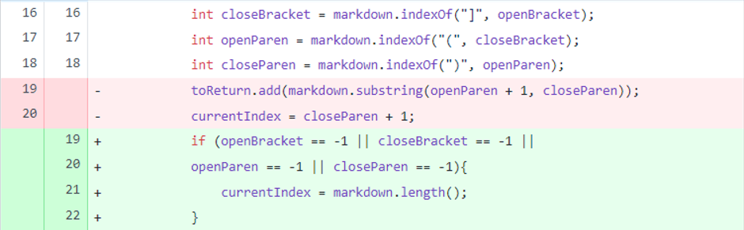
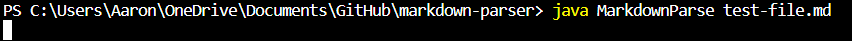
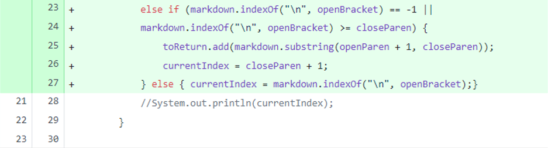
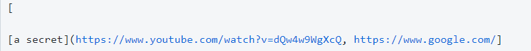
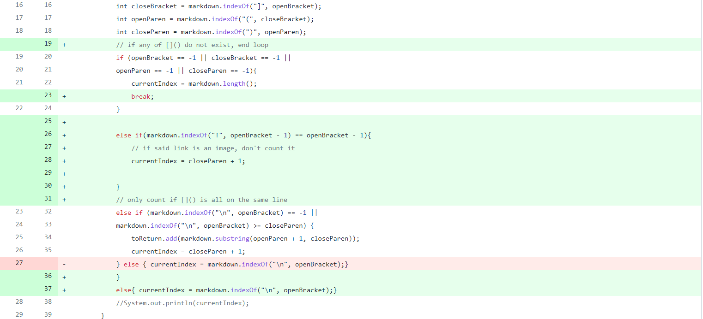
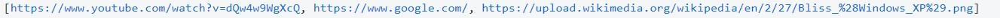

# **Lab Report 2 - Week 4**

 ## **Change 1** 

 
 [test that caused the error](https://github.com/akann0/markdown-parser/blob/9cc42a8f0b4f1d6eeb83bab8ba245fa8887fdd5f/test-file.md)

### Symptom:
 

### Writeup
At first, the line of code easily crashes.  For all tests that do 
not end in a link, the while loop never stops.  The updated
code has the while loop condition met anytime the value of an 
indexOf method hits -1, causing the loop to end when the last 
line of code is met.  

## **Change 2** 

 
 [test that caused the error](https://github.com/akann0/markdown-parser/blob/47239696c998306a7621296c803d5ea2e3a33ace/Tester.md)

### Symptom:
 

### Writeup
The second test that caused my code to crash was using the
indicators out of context. To fix this error, I added code to 
ensure that the link was only counted if the indicators of a link 
were not used on different lines.

## **Change 3** 

 
 [test that caused the error](https://github.com/akann0/markdown-parser/blob/b05c39457e79545a3646e3ddd5a6ab4dc8063621/Tester.md)

### Symptom:
 

### Writeup
At first, the code does not distinguish between an image and a 
hyperlink.  This is understandable because there is little 
difference between the two syntax-wise. I added a check to make
sure that my code was not returning images as links.  

