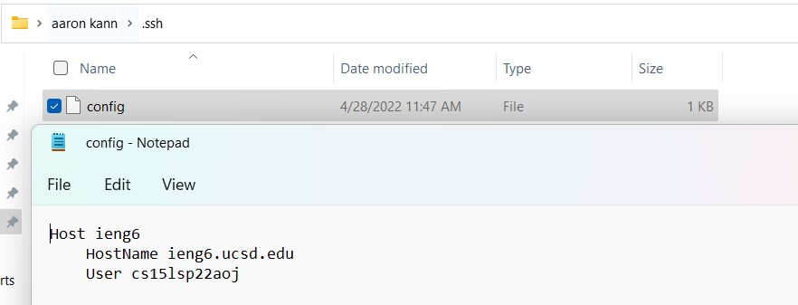
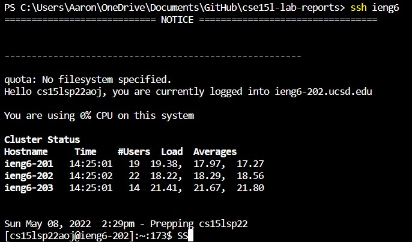
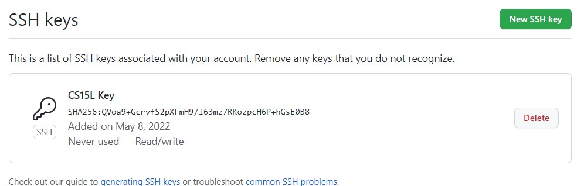
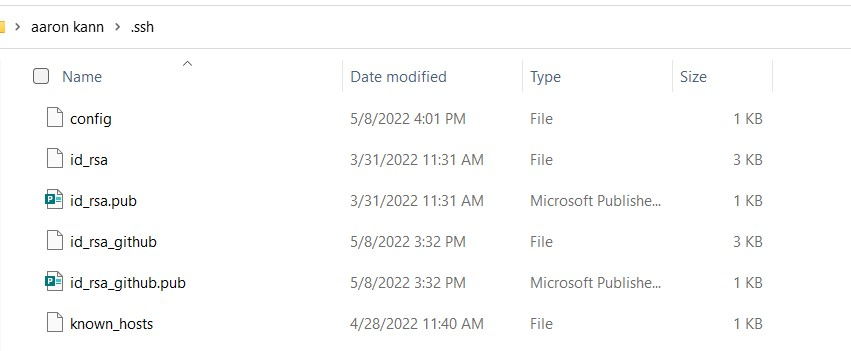
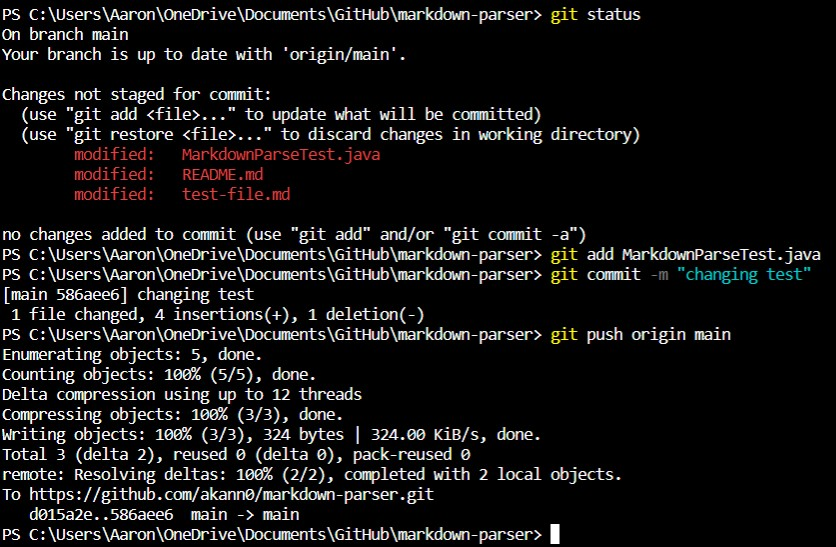
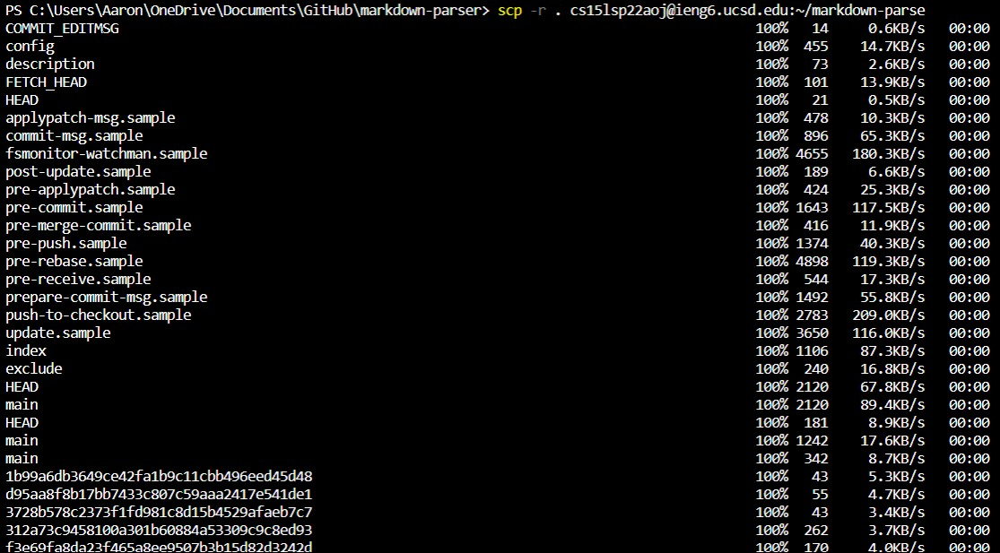
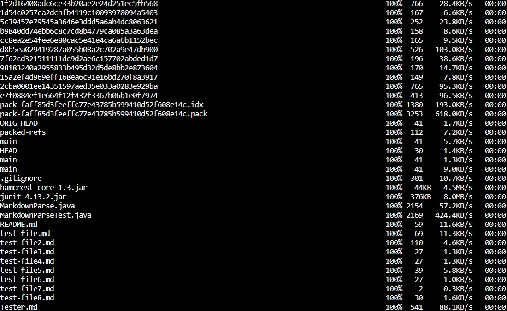
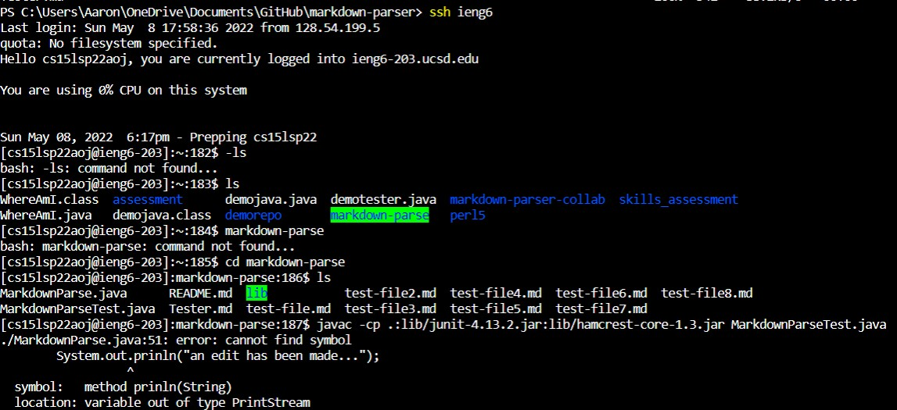
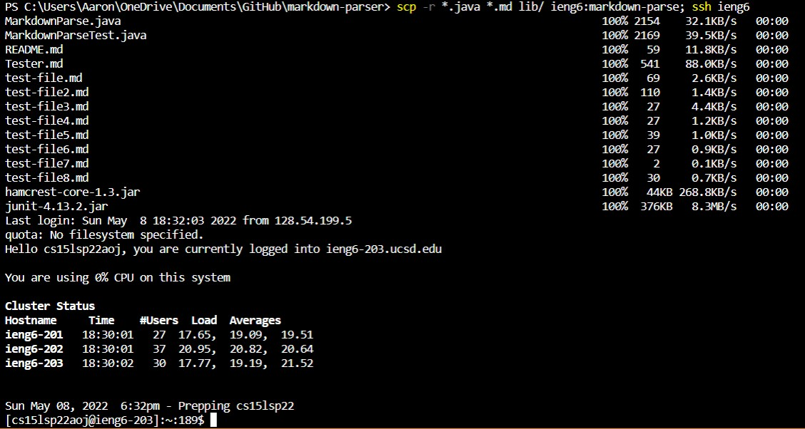

# **Lab Report 3 - Week 6**

 ## **Task 1**  

 ### **I edited the config file using notepad**
 

 ### **This shows me logging in using the shortcut**
 

 ### **Here's me copying a file using the shortcut** 
 

 ## **Task 2**

 ### **The public key is stored online with all the other ssh keys** 
 

 ### **A public and private key is stored in the .ssh folder** 
 

 ### **Here's me running git commands in my terminal**
  

 ### **Here's me running git commands in my terminal**
  

 ### **A link to the new [commit](https://github.com/akann0/markdown-parser/commit/586aee66e3ce4b4042041eab4226539d532df786)**

 ## **Task 3**

  ### **This is me copying the entire file and pasting it into ieng6** 
  
 ...
 

 ### **This attempt to compile the code didn't work due to a typo in the file** 
 

 ### **Combining the scp and ssh commands!** 
 