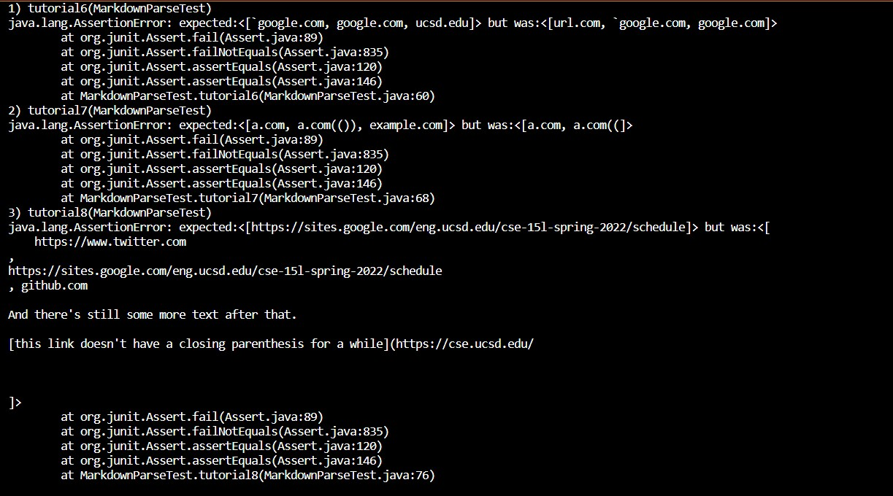

# Lab Report 4, week 8

[link to my repo](https://github.com/akann0/markdown-parser)

[link to the other repo](https://github.com/cynthia-bao/markdown-parser)

## Testing My Implementation

The first test should return the list
["'google.com", "google.com", "ucsd.edu"]

The second test should return the list
["a.com", "a.com(())", "example.com"]

The third test should return the list
["https://sites.google.com/eng.ucsd.edu/cse-15l-spring-2022/schedule"]

Here are the tests I made in MarkdownParseTest.java

Here are the results of running MarkdownParseTest on my own code

Here are the results of running MarkdownPrseTest on the other code

In order to make my code work with backticks, all 
brackets that are in between backticks should not count.  I 
think this can be done with a section of code that is less than 
10 lines long.

In order to make my code work with nested parenthesis, I have to 
count the amount of parentheses that are nested within
my code, and not count the outer parenthesis until all the nested 
parentheses pairs are accounted for.  This can likely be done in 
a code snippet that is less than 10 lines long.

In order to make the third code snippet work, I would have to 
adjust the changes I already made in my code.  My code right now
does not allow links to take up mulitple lines, however, the     
second line works as a link because the new lines are immediately
before or after the parenthesis.  Adjusting my code so this is  
allowed should add less than 10 lines of code to my program.

