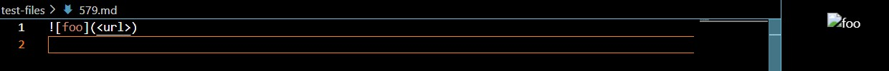

# Lab Report 5, week 10

I found the tests that showed different results 
using java.  I copy and pasted my getLinks method onto
the given MarkdownParse method.  I then asked the code to 
compare the outputs of these two methods, and print the filename
if they were not equal.  Using this method I found the 22 tests 
with different outputs.  

[Test Case 1 - #22](https://github.com/nidhidhamnani/markdown-parser/blob/main/test-files/22.md)

[Test Case 2 - #579](https://github.com/nidhidhamnani/markdown-parser/blob/main/test-files/579.md)

## Disagreement 1 - Case 22

For test case 22, the given code returns []
whereas my code returns [/bar\\* "ti\*tle"].  

Both codes are wrong, as the link shown is that of 
"ti/*tle". Therefore the code should return 
["ti/*tle"].

We can fix the error by adding the code that
removes all link with a space in my code first. 
Then, we must add an exception to that rule if 
/bar\\* comes before a string that is written in
parentheses.  

## Disagreement 2 - Case 579

For test case 22, the given code returns [<url>]
whereas my code returns [].

In this case, my code is correct.  This is an 
image and not a url, therefore nothing should
be returned.

This is because the given code does not account 
for images, which looks like a link but has an !
before the brackets([]).  We should check for this 
before adding a string to getLinks.  